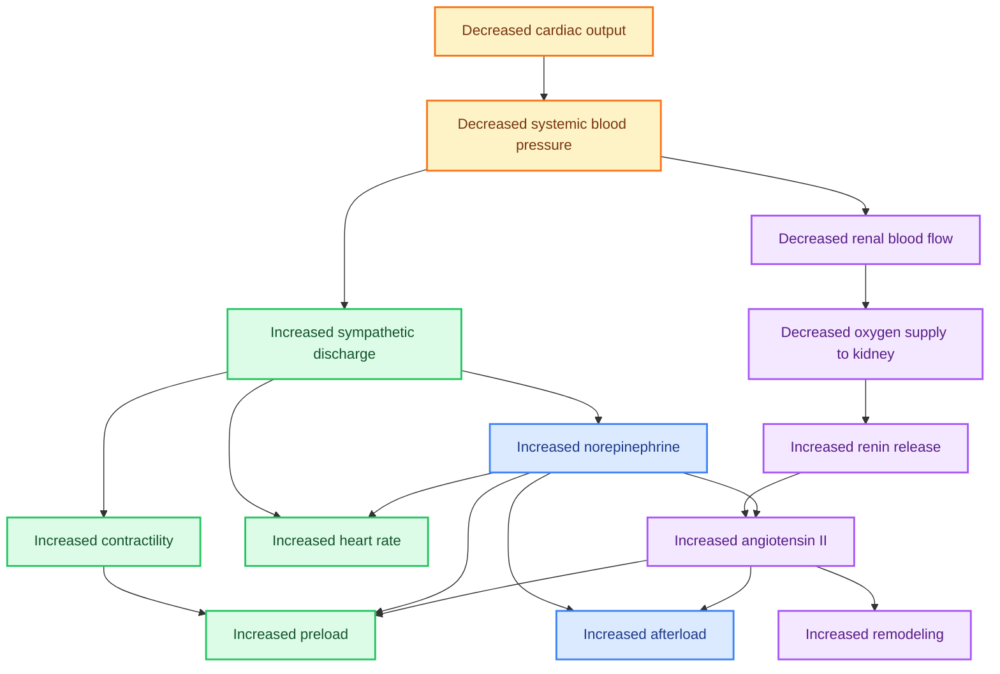

# CHAPTER 39 

## HEART FAILURE

## Anthony M. Angelow

## PATHOPHYSIOLOGY

Types of Heart Failure
Classifications of Heart Failure
Symptoms of Heart Failure

## PHARMACODYNAMICS

GOALS OF TREATMENT

## RATIONAL DRUG SELECTION

Guidelines
Diagnosis of Heart Failure
Treatment Recommendations Based on Stage of Heart Failure
Pharmaceutical Therapy for Heart Failure
Additional Patient Variables
Drug Combinations

## MONITORING

OUTCOME EVALUATION

## PATIENT EDUCATION

Heart failure (HF) is a major health problem that, according to estimates from the American Heart Association (AHA), affects more than six million Americans (Benjamin et al, 2017; Roger, 2021). The underlying HF incidence increases with age, so the prevalence has increased over the past decade as the U.S. population ages. With the growth in the aging population, incidence of HF is expected to increase significantly. Furthermore, the incidence of HF is disproportionately higher in the Black population compared with other populations. Despite aggressive investigation into treatment options, the mortality rate remains $50 \%$ within 5 years of diagnosis (Roger, 2021). Of particular importance in HF management is following Guideline-Directed Medical Therapy (GDMT), which encompasses clinical evaluation, diagnostic evaluation, pharmacological intervention, and procedural interventions to effectively manage HF. In addition, providers must address the patient's underlying pathophysiology leading to the development of HF and associated diagnoses (Benjamin et al, 2017; Heidenreich et al, 2022). This carefully designed program maximizes outcomes and prevents or delays treatment complications such as renal failure, cardiovascular complications, and death. The GDMT model focuses on multiple pharmacological regimens making patient education essential to limiting complications, hospitalizations, and hospital readmissions that result from poor adherence to the treatment regimen (Heidenreich et al, 2022).

## PATHOPHYSIOLOGY

HF is a complex clinical syndrome that can result from any structural or functional cardiac disorder that results in a cardiac output that is inadequate to satisfy the oxygen demands of the body. HF syndrome is subdivided into two distinct classifications: HF with reduced ejection fraction ( $\mathrm{HFrEF}$ ) and HF with preserved ejection fraction ( $\mathrm{HFrEF}$ ). $\mathrm{HFrEF}$ is associated with left ventricular (LV) systolic dysfunction, whereas $\mathrm{HFrEF}$ exists in the presence of a normal or supranormal ejection fraction (EF). The EF is the percentage of blood ejected from the left ventricle during systole and is a direct component of cardiac output (Miller \& Banasik, 2018). Left ventricular dysfunction (systolic HF) begins with injury to the myocardium; or more specifically, impaired cardiac output with activation of physiological compensatory mechanisms, such as sodium retention to maintain afterload and preload, as well as increased heart rate to maintain tissue oxygenation. These normal compensatory mechanisms continue and become pathological even in the absence of additional myocardial insults. The principal mechanism relates to remodeling, which occurs as a homeostatic mechanism to decrease wall stress through increases in wall thickness. The cells generated during remodeling are often abnormal and include a proliferation of connective tissue cells. The ultimate result is a change in the structure of the left ventricle in which the chamber dilates, hypertrophies, and becomes more spherical. This process generally precedes the development of symptoms but continues after their appearance and may contribute to the worsening of symptoms despite treatment (Miller \& Banasik, 2018).

As the left ventricle hypertrophies, the sarcomeres of the muscle cells lengthen so that limited numbers of cross-bridges can form and function appropriately and contractile force degenerates. Contractility of heart muscle is a function of the interaction of calcium with the actin-troponin-tropomyosin system. Activator calcium released from the sarcoplasmic reticulum facilitates the interaction of actin with myosin to create the cross-bridging that produces contraction. The amount of calcium released depends on the amount in stores and the amount that enters the cell during the plateau phase of the action potential. The reduced force at systole causes the ventricles to supply inadequate blood volume to the body and blood pressure (BP) drops, even though the ventricle is very full and overstretched. This triggers counterregulatory mechanisms in the rest of the body, activating the sympathetic nervous system (SNS) and the renin-angiotensinaldosterone system (RAAS; Figure 39-1). The SNS increases heart rate, tries to increase contractile force, and increases venous tone. With continued activation of the SNS, there is downregulation of the beta, receptors in the myocardium and baroreceptors, decreasing responsiveness to catecholamines and reduced heart rate variability (Biglane et al, 2017). The RAAS triggers the retention of sodium and water to increase blood volume and venous return (increased preload). Initially, this brings more venous return to the heart and increases the amount of blood available to the body (Jia et al, 2018).

The natriuretic peptide system counterregulates the negative effects of the RAAS, which occurs in HF by inhibiting vasopressin and modulating the SNS. Natriuretic peptides promote vasodilation and diuresis. There are three types of natriuretic peptides: A-natriuretic peptide, B-natriuretic peptide, and Cnatriuretic peptide. The B-natriuretic peptide (BNP) is released from the myocytes of the left ventricle and is a potent marker of HF. Neprilysin is an endopeptidase that cleaves BNP (and other peptides) into the inactive form, thus inactivating the vasoactive properties. This novel approach is an important pharmacokinetic target for treatment of HF (Arrouve \& Shamilyan, 2017; Jhund \& McMurray, 2016; Yancy et al, 2017).

In the long term, these adaptive mechanisms actually create more failure. The ventricle that is already full and stretched is required to deal with more volume. The long-term activation of the RAAS results in excessive concentrations of renin, angiotensin II, aldosterone, and vasopeptides. Angiotensin II is one of the most important peptides responsible for ventricular remodeling and endothelin dysfunction (Biglane et al, 2017). Aldosterone oversecretion results in fibrosis of the ventricular wall. The SNS and RAAS are important pathways targeted in the treatment and management of LV systolic dysfunction (Hartopee \& Mann, 2016).

<figure>
  <figcaption align="center">
    <strong>Figure 39-1. Compensatory responses in HF.</strong> 
    Flowchart illustrating the physiological responses to decreased cardiac output and systemic blood pressure. The diagram details the sequence of events starting from decreased cardiac output leading to reduced systemic blood pressure. This triggers increased sympathetic discharge, which enhances heart contractility and heart rate. Simultaneously, decreased renal blood flow and oxygen supply to the kidney stimulate renin release, increasing norepinephrine and angiotensin levels. These processes collectively aim to restore cardiovascular homeostasis.
  </figcaption>
</figure>