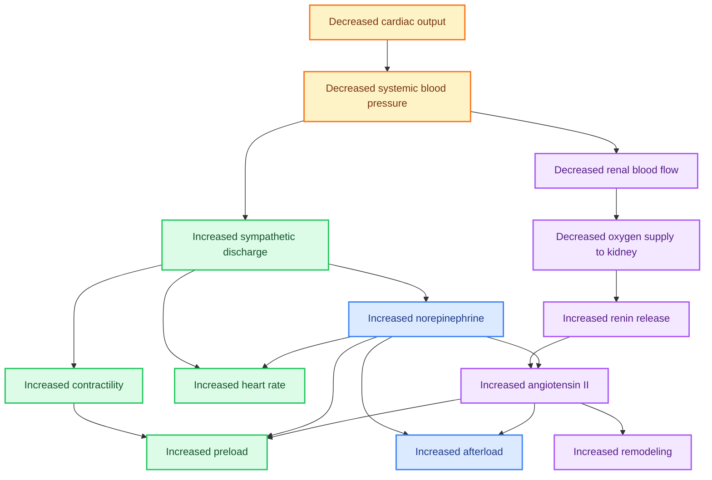

Authored by *Anthony M. Angelow*.


- Pathophysiology
    - Types of Heart Failure
    - Classifications of Heart Failure
    - Symptoms of Heart Failure
- Pharmacodynamics
    - Goals of Treatment
- Rational Drug Selection
    - Guidelines
    - Diagnosis of Heart Failure
    - Treatment Recommendations Based on Stage of Heart Failure
    - Pharmaceutical Therapy for Heart Failure
    - Additional Patient Variables
    - Drug Combinations
- Monitoring
    - Outcome Evaluation
- Patient Education


### Summary

Heart failure (HF) is a major health problem that, according to estimates from the American Heart Association (AHA), affects more than six million Americans (Benjamin et al, 2017; Roger, 2021). The underlying HF incidence increases with age, so the prevalence has increased over the past decade as the U.S. population ages. With the growth in the aging population, incidence of HF is expected to increase significantly. Furthermore, the incidence of HF is disproportionately higher in the Black population compared with other populations. Despite aggressive investigation into treatment options, the mortality rate remains $50 \%$ within 5 years of diagnosis (Roger, 2021). Of particular importance in HF management is following Guideline-Directed Medical Therapy (GDMT), which encompasses clinical evaluation, diagnostic evaluation, pharmacological intervention, and procedural interventions to effectively manage HF. In addition, providers must address the patient's underlying pathophysiology leading to the development of HF and associated diagnoses (Benjamin et al, 2017; Heidenreich et al, 2022). This carefully designed program maximizes outcomes and prevents or delays treatment complications such as renal failure, cardiovascular complications, and death. The GDMT model focuses on multiple pharmacological regimens making patient education essential to limiting complications, hospitalizations, and hospital readmissions that result from poor adherence to the treatment regimen (Heidenreich et al, 2022).

## PATHOPHYSIOLOGY

HF is a complex clinical syndrome that can result from any structural or functional cardiac disorder that results in a cardiac output that is inadequate to satisfy the oxygen demands of the body. HF syndrome is subdivided into two distinct classifications: HF with reduced ejection fraction ( $\mathrm{HFrEF}$ ) and HF with preserved ejection fraction ( $\mathrm{HFrEF}$ ). $\mathrm{HFrEF}$ is associated with left ventricular (LV) systolic dysfunction, whereas $\mathrm{HFrEF}$ exists in the presence of a normal or supranormal ejection fraction (EF). The EF is the percentage of blood ejected from the left ventricle during systole and is a direct component of cardiac output (Miller \& Banasik, 2018). Left ventricular dysfunction (systolic HF) begins with injury to the myocardium; or more specifically, impaired cardiac output with activation of physiological compensatory mechanisms, such as sodium retention to maintain afterload and preload, as well as increased heart rate to maintain tissue oxygenation. These normal compensatory mechanisms continue and become pathological even in the absence of additional myocardial insults. The principal mechanism relates to remodeling, which occurs as a homeostatic mechanism to decrease wall stress through increases in wall thickness. The cells generated during remodeling are often abnormal and include a proliferation of connective tissue cells. The ultimate result is a change in the structure of the left ventricle in which the chamber dilates, hypertrophies, and becomes more spherical. This process generally precedes the development of symptoms but continues after their appearance and may contribute to the worsening of symptoms despite treatment (Miller \& Banasik, 2018).

As the left ventricle hypertrophies, the sarcomeres of the muscle cells lengthen so that limited numbers of cross-bridges can form and function appropriately and contractile force degenerates. Contractility of heart muscle is a function of the interaction of calcium with the actin-troponin-tropomyosin system. Activator calcium released from the sarcoplasmic reticulum facilitates the interaction of actin with myosin to create the cross-bridging that produces contraction. The amount of calcium released depends on the amount in stores and the amount that enters the cell during the plateau phase of the action potential. The reduced force at systole causes the ventricles to supply inadequate blood volume to the body and blood pressure (BP) drops, even though the ventricle is very full and overstretched. This triggers counterregulatory mechanisms in the rest of the body, activating the sympathetic nervous system (SNS) and the renin-angiotensinaldosterone system (RAAS; Figure 39-1). The SNS increases heart rate, tries to increase contractile force, and increases venous tone. With continued activation of the SNS, there is downregulation of the beta, receptors in the myocardium and baroreceptors, decreasing responsiveness to catecholamines and reduced heart rate variability (Biglane et al, 2017). The RAAS triggers the retention of sodium and water to increase blood volume and venous return (increased preload). Initially, this brings more venous return to the heart and increases the amount of blood available to the body (Jia et al, 2018).

The natriuretic peptide system counterregulates the negative effects of the RAAS, which occurs in HF by inhibiting vasopressin and modulating the SNS. Natriuretic peptides promote vasodilation and diuresis. There are three types of natriuretic peptides: A-natriuretic peptide, B-natriuretic peptide, and Cnatriuretic peptide. The B-natriuretic peptide (BNP) is released from the myocytes of the left ventricle and is a potent marker of HF. Neprilysin is an endopeptidase that cleaves BNP (and other peptides) into the inactive form, thus inactivating the vasoactive properties. This novel approach is an important pharmacokinetic target for treatment of HF (Arrouve \& Shamilyan, 2017; Jhund \& McMurray, 2016; Yancy et al, 2017).

In the long term, these adaptive mechanisms actually create more failure. The ventricle that is already full and stretched is required to deal with more volume. The long-term activation of the RAAS results in excessive concentrations of renin, angiotensin II, aldosterone, and vasopeptides. Angiotensin II is one of the most important peptides responsible for ventricular remodeling and endothelin dysfunction (Biglane et al, 2017). Aldosterone oversecretion results in fibrosis of the ventricular wall. The SNS and RAAS are important pathways targeted in the treatment and management of LV systolic dysfunction (Hartopee \& Mann, 2016).




{}
Flowchart illustrating the physiological responses to decreased cardiac output and systemic blood pressure. The diagram details the sequence of events starting from decreased cardiac output leading to reduced systemic blood pressure. This triggers increased sympathetic discharge, which enhances heart contractility and heart rate. Simultaneously, decreased renal blood flow and oxygen supply to the kidney stimulate renin release, increasing norepinephrine and angiotensin levels. These processes collectively aim to restore cardiovascular homeostasis.
{}


Diuretics are a critical component of pharmacological therapy because they decrease the symptoms of congestion associated with HF by reducing increased extracellular fluid volume. As HF progresses, the heart is unable to adequately circulate the blood volume, resulting in congestive symptoms. The heart is divided into right and left heart. During exacerbation of LV systolic dysfunction, the result is an increase in the LV end-diastolic pressure (volume), resulting in increased preload and decreased capacity during diastole. The pressure gradient backs up into the pulmonary artery and subsequently transmigration of plasma across the pulmonary capillary into the pulmonary interstitial space. Left untreated, this results in pulmonary symptoms of a cough, dyspnea, orthopnea, paroxysmal dyspnea, and hemoptysis. Untreated, left-sided HF can result in right-sided HF and right-sided symptoms, including presence of jugular venous distention, hepatojugular reflux, hepatomegaly, anorexia, and bilateral dependent peripheral edema (Miller \& Banasik, 2018).

The most important risk factors for HF include hypertension (HTN), diabetes mellitus (DM), metabolic syndrome, and atherosclerotic disease. Hypertension remains the single most modifiable risk factor. Adequate control of hypertension can decrease the risk of HF by approximately $50 \%$. Diabetes mellitus, which includes obesity and insulin resistance, increases the risk of development of HF without noticeable structural disease, and left untreated, adversely affects HF outcomes. Up to $20 \%$ to $40 \%$ of individuals with HF have the metabolic syndrome. Adequate control of the factors related to metabolic syndrome greatly reduces the risk of HF occurrence (Heidenreich et al, 2022).

There are other risk factors and comorbidities influencing the prevalence of HF. On average, research indicates that patients with HF have a mean of four comorbidities, including hypertension, coronary artery disease, chronic kidney disease, atrial fibrillation, DM, obesity, osteoarthritis, cancer, and depression. The increased prevalence of patients with DM, hypertension, obesity, chronic kidney disease, and cancer-related diagnoses contributes to a rise in the development of HF (Lawson et al, 2020).

### Types of Heart Failure 

Historically, the two main forms of HF were systolic and diastolic dysfunction (Yancy et al, 2013). In most recent guidelines, heart failure is better classified by the left ventricular ejection fraction (LVEF) as heart failure with reduced ejection fraction (HFrEF) or heart failure with preserved ejection fraction (HFpEF). HFrEF is most commonly associated with systolic dysfunction and occurs after a structural change in the ventricular wall where a decrease in the contractility is observed. The problem is inadequate force generated to eject blood from the ventricles, resulting in decreased cardiac output and EF of less than or equal to $40 \%$. Patients may also be classified as heart failure with improved ejection fraction (HFimpEF). These patients had a previous EF of less than or equal to $40 \%$ and a follow-up measurement of the LVEF now indicates an LVEF of greater than $40 \%$ (Heidenreich et al, 2022).

HFpEF is most associated with diastolic dysfunction. However, it is important to note that patients with HFrEF may also have features of diastolic dysfunction. HFpEF results from inadequate relaxation and loss of muscle fiber elasticity, resulting in a slower filling rate and elevated diastolic pressures. Although cardiac output is reduced, LVEF remains within normal limits (greater than or equal to $50 \%$ ). The diagnosis of HFpEF remains challenging and will be discussed later in this chapter (Heidenreich et al, 2022).

### Classifications of Heart Failure

The New York Heart Association (NYHA) has classified HF based on the severity of symptoms. This functional classification reflects the amount of activity needed to produce symptoms. It is fairly subjective and treatments used do not differ significantly across the classes. In addition, this system does not deal with patients who are asymptomatic or at high risk for the development of HF. The AHA/ACC/HFSA committee sought to develop a staging system that would objectively identify patients throughout the course of their disease and would be linked to treatments that were uniquely appropriate for each stage of their illness. In addition, this classification scheme recognizes that HF, like HTN and coronary artery disease (CAD), has established risk factors, evolution of the disorder has asymptomatic as well as symptomatic phases, and treatment prescribed at each stage can reduce the morbidity and mortality of HF (Heidenreich et al, 2022). Table 39-1 compares these two classifications.

**Table 39-1 Comparison of Classification Systems for Heart Failure (HF)**

| New York Heart Association | American College of Cardiology/American Heart Association |
| :--: | :--: |
| Class I. No limitations. Ordinary physical activity does not cause fatigue, breathlessness, or palpitation. (Asymptomatic left-ventricular dysfunction is included in this category.) | Stage A. Patient at high risk for developing HF but without structural heart disease |
| Class II. Slight limitations of physical activity. Comfortable at rest, but ordinary physical activity results in fatigue, palpitation, breathlessness, or angina pectoris (symptomatically "mild" HF). | Stage B. Patient with a structural disorder of the heart but who has never developed symptoms of HF |
| Class III. Marked limitations of physical activity. Although patient is comfortable at rest, less than ordinary physical activity will lead to symptoms (symptomatically "moderate" HF). | Stage C. Patient with past or current symptoms of HF associated with underlying structural disease |
| Class IV. Inability to carry on any physical activity without discomfort. Symptoms of congestive HF are present even at rest. With any physical activity, increased discomfort is experienced (symptomatically "severe" HF). | Stage D. Patient with end-stage disease who requires specialized treatment strategies such as mechanical circulatory support, continuous inotropic infusions, cardiac transplantation, or hospice care |

Sources: Criteria Committee of the New York Heart Association. (1994). Nomenclature and criteria for diagnosis of diseases of the heart and great vessels (9th ed., pp. 253-256). Boston: Little, Brown \& Co.; Yancy, C. W., Jessup, M., Bozkurt, B., Butler, J., Casey, D. E., Drazner, M. H., Wilkoff, B. L. (2013). 2013 ACCF/AHA guideline for the management of heart failure: Executive summary. Circulation, 128, 1810-1852.

### Symptoms of Heart Failure 

The symptoms of HF tend to be vague and nonspecific and may overlap with the symptoms associated with comorbidities. A major component of evaluating symptoms to determine appropriate treatment is identifying the presence of issues with congestion and/or perfusion (Heidenreich et al, 2022). Common symptoms of HF include dyspnea, persistent cough, peripheral edema, and fatigue (American Heart Association, 2017). Regardless of which ventricle is more involved, patients with HF often have a number of symptoms with the most common being breathlessness, fatigue, exercise intolerance, and weight gain secondary to fluid retention. None of these symptoms independently are specific to HF and several other disorders; however, clusters of symptoms can be used to make a diagnosis of HF. The diagnosis of HF depends on a thorough history and an appropriate physical examination, supplemented by diagnostic tests. Diagnostic evaluation will be presented later. The clinical course of the disease depends in large part on the point at which the patient is diagnosed and treatment is started, the appropriate targeting of that treatment, and the underlying pathology (Heidenreich et al, 2022).

## PHARMACODYNAMICS

The mainstay of HF therapy is lifestyle management, pharmaceutical treatment to alter the appropriate physiological mechanisms, and treatment of the symptoms of HF. The main pharmaceutical categories used to treat systolic HF are diuretics, renin-angiotensin system inhibitors, angiotensin-converting enzyme (ACE) inhibitors, angiotensin receptor blockers (ARBs), angiotensin receptor-neprilysin inhibitors (ARNIs), beta blockers, mineralocorticoid receptor antagonists (MRAs), and sodium-glucose cotransporter 2 (SGLT2) inhibitors (Heidenreich et al, 2022) (Table 39-2).

Diuretics reduce preload by decreasing extracellular fluid volume and can be used to decrease HTN that increases afterload. Renin-angiotensin system inhibitors act on the RAAS to decrease preload and afterload. In addition to the hemodynamic effects, these pharmacological agents prevent the production of angiotensin II and aldosterone or block the receptors that accept angiotensin II. Both of these molecular structures create hypertrophy and fibrosis of the myocytes in the left ventricle. Beta-adrenergic blockers affect the SNS counterregulatory mechanism of HF, as well as decrease ventricular wall tension, decrease apoptosis of the baroreceptors, and prevent downregulation of the beta ${ }_{A}$ receptors. MRAs prevent the release of aldosterone from the adrenal glands, which has been shown to increase myocyte fibrosis (Shah et al, 2017). SGLT2 inhibitors are utilized specifically in the presence of type 2 DM with HF. Adequate control of DM not only significantly decreases the risk of HF but also decreases mortality in patients diagnosed with HF (Lenahan et al, 2021).

## GOALS OF TREATMENT

There are three goals of therapy used to determine treatment options: improvement of symptoms, reduction in morbidity, and reduction in mortality. Specific drug therapies are supported by research documenting their efficacy in attaining one or more of these goals. Physiological goals are to decrease overload (preload and/or afterload), improve contractility, and decrease heart rate. Rational drug selection can be based on these goals, on the mechanism behind the dysfunction, and on the symptom severity of the disease process (Heidenreich et al, 2022).

## RATIONAL DRUG SELECTION

### Guidelines

Although the AHA/ACC/HFSA classification system is intended to complement, not replace, the NYHA classification, the AHA/ACC/HFSA guidelines will be the main source of recommendations throughout this chapter. These clinical practice guidelines describe the management of patients with both HFrEF and HFpEF. Figure 39-2 depicts the stages in the evolution of HF and the recommended therapy at each stage.

## Diagnosis of Heart Failure

The diagnosis of HF is based on an algorithmic approach and begins with an assessment of signs and symptoms. The assessment must include a clinical history and physical examination for any risk factors or symptoms of HF. The Framingham criteria can assist with predicting the development of HF. It combines specific criteria looking for two major or one major and two minor criteria (see Table 39-3). In addition, an electrocardiogram (ECG) is useful in identifying any potential cardiac dysrhythmias and potential structural abnormalities. Last, the assessment should include a laboratory analysis of natriuretic peptides to suggest a diagnosis of HF. An n-terminal pro b-type natriuretic peptide (NT-proBNP) level greater than $125 \mathrm{pg} / \mathrm{mL}$ or a brain natriuretic peptide (BNP) level of greater than or equal to $35 \mathrm{pg} / \mathrm{mL}$ is suggestive of HF and the need for further diagnostic evaluation (Heidenreich et al, 2022). It is important to note that the emerging use of ARNI therapy will result in elevated BNP levels but will not artificially increase the NTproBNP level. More than a diagnostic criterion, the measurement of circulating levels of natriuretic peptide is used to identify patients with elevated LV filling pressures who are likely to exhibit signs and symptoms of HF. The BNP or the NT-proBNP measurement is useful to differentiate dyspnea due to HF from dyspnea due to other causes in the emergency setting (Yancy et al, 2017).

**Table 39-2 Dosage Schedule: Drugs Ffor Heart Failure**

|  Drug | Indications | Forms | Initial Dose | Maintenance Dose  |
| --- | --- | --- | --- | --- |
|  Thiazide Diuretics
Hydrochlorothiazide (Microzide) | Initial therapy for volume overload | Tablets: $12.5,25,50,100$
mg
Liquid: $50 \mathrm{mg} / 5 \mathrm{~mL}$ | 25 mg daily | 50 mg daily  |
|  Loop Diuretics | Added therapy when resistant to standard therapy or for decompensation |  |  |   |
|  Furosemide (Lasix)
Bumetanide (Bumex)
Torsemide (Demadex) | Furosemide is first choice. Torsemide is best when high doses of furosemide are required. | Tablets: $20,40,80 \mathrm{mg}$ Injection: $40 \mathrm{mg} / 5 \mathrm{~mL}$ Injection: $0.5,1,2 \mathrm{mg}$ Injection: $5,10,20,100 \mathrm{mg}$ | 20-40 mg daily or twice daily
$0.5-1 \mathrm{mg}$ daily or twice daily
$10-20 \mathrm{mg}$ daily | As needed
As needed
As needed  |
|  Angiotensin-Converting Enzyme (ACE) Inhibitors |  |  |  |   |
|  Captopril (Capoten)
Enalapril (Vasotec)
Lisinopril (Zestril)
Quinapril (Accupril) | All subsets of patients. Initial therapy | Tablets: $12.5,25,50,100$
mg
Tablets: $2.5,5,10,20 \mathrm{mg}$
Tablets: $2.5,5,10,20,30$,
40 mg
Tablets: $5,10,20,40 \mathrm{mg}$ | 6.25 mg tid
2.5 mg bid
$2.5-5 \mathrm{mg}$ daily
5 mg bid | 50 mg tid
10 mg bid
20 mg daily
20 mg daily  |
|  Angiotensin II Receptor Blocker |  |  |  |   |
|  Losartan (Cozaar)
Valsartan (Olevan)
Candesartan (Atacand) | Patients intolerant to ACE inhibitors | Tablets: $25,50,100 \mathrm{mg}$
Tablets: $40,80,160,320$
mg
Tablets: $4,8 \mathrm{mg}, 16,32 \mathrm{mg}$ | 12.5-25 mg daily
20-40 mg daily
$4-8 \mathrm{mg}$ daily | 50-150 mg daily
160 mg twice daily
32 mg daily  |
|  Digoxin (Lanoxin) | If symptoms unrelieved by traditional therapy | Tablets: $0.125,0.25 \mathrm{mg}$ Injection: $0.05 \mathrm{mg} / 1 \mathrm{~mL}$ | $0.125-0.25 \mathrm{mg}$ daily | Individualized to target serum concentration of $0.5-0.89 \mathrm{ng} / \mathrm{mL}$  |
|  Isosorbide dinitrate (Isordil) | With hydralazine for intolerance to ACE inhibitor | Tablets: $5,10,20,30,40$
mg ER
Sublingual: $2.5,5 \mathrm{mg}$ | 20 mg 4 times daily | 40 mg 4 times daily  |
|  Angiotensin Receptor-Neprilysin Inhibitor (ARNI) |  |  |  |   |
|  Sacubitril/valsartan (Entresto) | Add to heart failure therapy, after discontinuing ACE | Tablets:
$24 \mathrm{mg} / 26 \mathrm{mg}$
$49 \mathrm{mg} / 51 \mathrm{mg}$
$97 \mathrm{mg} / 103 \mathrm{mg}$ | Start at $24 \mathrm{mg} / 26 \mathrm{mg}$ and increase every $2-4 \mathrm{wk}$ until target goal reached | $97 \mathrm{mg} / 103 \mathrm{mg}$ twice daily  |
|  Beta Blockers |  |  |  |   |
|  Carvedilol (Coreg, Coreg CR)
Metoprolol succinate (Toprol-XL)
Bisoprolol (Zebeta) | Patients with diastolic dysfunction or cardiomyopathy in whom reduced heart rate can improve cardiac output | Tablets: $3.125,6.25,12.5$,
25 mg
Extended-release tablets: $10,20,40,80 \mathrm{mg}$
Tablets: $25,50,100,200$
mg
Tablets: $5,10 \mathrm{mg}$ | 3.125 mg bid
$12.5-25 \mathrm{mg}$ daily
1.25 mg daily | 6.25-25 mg twice daily 200 mg daily 10 mg daily  |
|  Ivabradine (Corlanor) | Add-on therapy for people with Stage C or D heart failure who have resting heart rate $>70$ beats/min | Tablets:
5 mg
7.5 mg | Start at 5 mg bid; titrate after 2 wk if needed | 7.5 mg bid  |
|  Aldosterone Antagonists |  |  |  |   |
|  Eplerenone (Inspra) |  | Tablets: $25,50 \mathrm{mg}$ | 25 mg daily | 50 mg daily  |
|  Spironolactone (Aldactone) |  | Tablets: $25,50,100 \mathrm{mg}$ | $12.5-25 \mathrm{mg}$ daily | $25-50 \mathrm{mg}$ daily  |
|  Sodium-Glucose Cotransporter 2 (SGLT2) Inhibitors |  |  |  |   |
|  Dapagliflozin | HF with diabetes | Tablets: $5,10 \mathrm{mg}$ | 10 mg daily | 10 mg daily  |
|  Empagliflozin | HF with diabetes | Tablets: $10 \mathrm{mg} ; 25 \mathrm{mg}$ | 10 mg daily | 10 mg daily  |

bid, twice a day; ER, extended release; HF, heart failure; tid, three times a day. Transthoracic echocardiography is probably the single most useful diagnostic tool because it facilitates identification of any structural abnormalities. Confirmation by echocardiography of HF diagnosis and/or cardiac dysfunction is mandatory and should be performed shortly after the diagnostic suspicion of HF. Echocardiography is the most practical measurement of ventricular dysfunction and can be used to distinguish between HFrEF and HFrEF (Heidenreich et al, 2012; Miller \& Banasik, 2018; Scottish Intercollegiate Guidelines Network [SIGN], 2016; Yancy et al, 2017). Although studies reveal that serum BNP levels have been shown to parallel the clinical severity of HF as assessed by NYHA functional class, their role in monitoring and adjusting drug therapy is less clearly established (Ouwerkerk et al, 2018; Yancy et al, 2017). Specific diagnostic tests useful in evaluation of HF include the following:

1. Chest x-rays may show cephalization of the vascular supply and 12-lead ECGs may show left-ventricular hypertrophy and axis deviation (SIGN, 2016). Although both provide baseline information, neither alone should form the primary basis for determining the specific cause of HF, because they are insensitive and nonspecific.
2. Complete blood count, urinalysis, serum electrolytes (including calcium and magnesium), blood urea nitrogen (BUN), serum creatinine, HbA1c, liver function studies, fasting lipid profiles, and thyroid-stimulating hormone are useful in determining possible treatable underlying causes of HF and in determining end-organ damage (SIGN, 2016).
3. Although the assessment of NT proBNP cannot reliably distinguish patients with systolic dysfunction from those with diastolic dysfunction, evidence supports its use in both diagnosis and management. There are a number of noncardiac reasons for elevated BNP (see Table 39-4) (Yancy et al, 2017).
4. Troponin I or T may be tested when the clinical picture suggests an acute coronary syndrome. Elevated troponin levels can also identify a cohort of patients with HF who are at higher risk. An initial determination of troponin should be obtained for patients presenting to the hospital with acute HF to assess for ACS, as well as provide guidance regarding risk stratification. An increase in cardiac troponins indicates myocyte necrosis and may identify the patient for whom revascularization should be considered (Gherasim, 2019).


<!--
**Annotation for img-0.jpeg:**
```json
{
  "image_type": "table",
  "short_description": "Stages of heart failure and corresponding therapies.",
  "summary": "This table outlines the progression of heart failure from Stage A to Stage D, detailing patient characteristics and recommended therapies at each stage. It begins with patients at high risk but without structural heart disease (Stage A), moves through structural heart disease without symptoms (Stage B), to structural heart disease with symptoms (Stage C), and finally to refractory heart failure requiring specialized interventions (Stage D). Each stage specifies therapies ranging from lifestyle changes and medication to advanced interventions like mechanical assist devices and heart transplantation.",
  "suggested_filename": "heart_failure_stages_and_therapies"
}
```
-->


**Table 39-3 Framingham Diagnostic Criteria for the Diagnosis of Heart Failure**

|  Major Criteria | Minor Criteria  |
| --- | --- |
|  Acute pulmonary edema | Dependent edema/ankle edema  |
|  Cardiomegaly | Dyspnea with exertion  |
|  Hepatojugular reflux | Hepatomegaly  |
|  Neck vein distention | Nocturnal cough  |
|  Paroxysmal nocturnal dyspnea or orthopnea | Pleural effusion  |
|  Rales | Tachycardia (>120 beats/min)  |
|  Third heart sound of 53 gallop |   |

Source: Adapted from McKee, P. A., Castelli, W. P., McNamara, P. M., \& Kannel, W. B. (1971). The natural history of congestive heart failure: The Framingham study. New England Journal of Medicine, 285, 1441-1446.

**Table 39-4 Selected Causes of Elevated Natriuretic Peptide Levels**

|  Cardiac | Noncardiac  |
| --- | --- |
|  Heart failure, including RV syndromes | Advancing age  |
|  Acute coronary syndrome | Anemia  |
|  Heart muscle diseases, including LVH | Renal failure  |
|  Valvular heart disease | Pulmonary: obstructive sleep apnea or pneumonia  |
|  Pericardial disease | Pulmonary hypertension  |
|  Atrial fibrillation | Any critical illness  |
|  Myocarditis | Bacterial sepsis  |
|  Cardiac surgery | Severe burns  |
|  Cardioversion |   |
|  Toxic-metabolic myocardial insults, including chemotherapy |   |

LVH, left ventricular hypertrophy; RV, right ventricular. Once the diagnosis is confirmed the results of the transthoracic echocardiogram will assist in determining the type of HF present based on the LVEF. An LVEF of less than or equal to $40 \%$ correlates with a diagnosis of HFrEF. An LVEF of $41 \%$ to $49 \%$ correlates with a diagnosis of heart failure midrange ejection fraction (HFmrEF). An LVEF of greater than or equal to $50 \%$ correlates with a diagnosis of HFmrEF. The patient is then evaluated further for precipitating factors and treatment is initiated based on national guideline recommendations (Heidenreich et al, 2022).

### Treatment Recommendations Based on Stage of Heart Failure

Patients with stage A HF are at high risk for developing HF but do not have structural heart disease or symptoms of HF. Initial treatment for HF is focused on reversing underlying pathologies if possible and treating precipitating factors. Lifestyle modification is the first step and includes avoidance of behaviors that may increase the risk for HF, such as smoking, poor diet choices, obesity, sedentary lifestyle, and consuming alcohol or illicit drugs. Lifestyle modification is appropriate in all stages of HF and is an adjunct to successful drug therapy (Aggarwal et al, 2018; Heidenreich et al, 2022; Yancy et al, 2017). The website www.heartfailurematters.org provided by the Heart Failure Association of the European Society of Cardiology (ESC) permits patients, their relatives, and caregivers to obtain useful, practical information in a user-friendly format.

Equally important are control of systolic and diastolic HTN and treatment of lipid disorders in accordance with recommended guidelines found in Chapters 43 and 42. Secondary prevention has a direct primary preventive effect on HF. Aggressive risk factor modification with lifestyle changes and pharmaceutical agents for the treatment of HTN, obesity, and hyperlipidemia has a profound impact on the development of HF. Large, controlled studies have demonstrated that optimal blood pressure control significantly decreases the risk of HF by approximately $50 \%$ (Heidenreich et al, 2022; Yancy et al, 2017). For patients with DM, blood glucose levels should be controlled in accordance with current diabetes management guidelines. Chapter 36 discusses the guidelines for this disorder. Heart failure treatment guidelines recommend the use of SGLT2 inhibitors to adequately control diabetes in the presence of HF (Heidenreich et al, 2022; Lenahan et al, 2021).

Patients with stage B HF have structural changes with the myocardium but have not had symptoms of HF. Treatment is focused on the secondary prevention of the underlying pathology using pharmacological and nonpharmacological interventions. Myocardial infarction (MI), ventricular hypertrophy from HTN or chronic obstructive pulmonary disease (COPD), and valvular heart disease without HF symptoms are examples. If the patient has confirmed stage B HFrEF, then GDMT is initiated. An ACE inhibitor and a beta blocker are recommended. If the patient experienced a recent MI and is intolerant to ACE inhibitors, then an ARB is recommended in the place of ACE inhibitors. ACE inhibitors and ARBs are not used in combination. Patients with an LVEF of less than or equal to $30 \%$ with an expected greater than 1-year survival and at least 40 days post-MI may be candidates for implantable cardioverter-defibrillator (ICD) placement (Heidenreich et al, 2022).

Patients with stage C HF have structural changes to the heart in addition to having overt signs and symptoms of HF. The first step of the treatment guidelines for stage C HFrEF start with relieving congestive symptoms with diuretics, as needed, while instituting pharmaceutical therapy with RAAS inhibitors, beta blockers, and MRAs. The choice of an RAAS inhibitor is focused on the NYHA classification. For patients with an NYHA classification of II or III, specifically, an ARNI is recommended. Patients in NYHA classes II-IV would be candidates for ACE inhibitor or ARB therapy. However, ACE inhibitors, ARBs, and ARNI pharmacotherapeutic agents are not used in combination. SGLT2 inhibitors are recommended for patients with a comorbidity of DM (Heidenreich et al, 2022).

The second step of stage C HFrEF treatment is to reevaluate the patient's LVEF. If the LVEF, on reevaluation, is greater than $40 \%$, the patient is reclassified as HFimpEF and the goal is to continue current GDMT and serial assessments to optimize dosing and to address the patient's goals of care. If the patient's LVEF remains less than or equal to $40 \%$, they are classified as persistent HFrEF and additional GDMT therapies are recommended based on the following patient scenarios:

- Hydral-nitrates for Black patients with an NYHA class III or IV.
- ICD placement for all patients with an NYHA class I to III with an LVEF less than or equal to $35 \%$ and an anticipated greater than 1-year survival.
- Cardiac resynchronization therapy (CRT) in all patients with an NYHA class II to IV with an LVEF less than or equal to $35 \%$, who are in normal sinus rhythm (NSR) and a QRS of greater than or equal to 150 ms with the presence of a left bundle branch block (LBBB). In addition, ambulatory patients who meet these criteria but have an NYHA class of IV would be candidates for this therapy. Serial reassessments and staging will contribute to continuing the current therapies or instituting additional GDMT therapies, especially as the patient proceeds to stage D HF, which may identify a need to change the patient-centered goals of care (Heidenreich et al, 2022).

Stage D HF is defined as refractory end-stage HF and necessitates specialty care referral for additional therapies. These patients have marked symptoms at rest despite maximal medical therapy. In stage D HFrEF, goals of care need to be discussed to determine the next steps of care. If active treatment remains the goal of care, the standard GDMT therapy, discussed in stage C recommendations, would continue, in addition to considerations for cardiac transplant and/or mechanical circulatory support (MCS) devices. As an alternative, the patient-centered goal may be reflective of palliative or hospice-based care depending on the expected prognosis. Last, investigational studies may be considered in consultation with specialty care referral (Heidenreich et al, 2022).

### Pharmaceutical Therapy for Heart Failure 

Drug therapy for the treatment and management of HF is a targeted approach to the different aspects of the neurohormonal pathways. RAAS inhibitors and beta blockers are the cornerstones of therapy for HF in all the guidelines and all stages. Based on the individual comorbid conditions, they are recommended to prevent HF for patients with a history of atherosclerotic vascular disease, DM, or HTN and associated cardiovascular risk factors (Heidenreich et al, 2022).

#### Angiotensin-Converting Enzyme Inhibitors
ACE inhibitors as a class have been shown to improve symptoms, decrease morbidity, and increase life expectancy in all populations (Andries et al, 2018; Biglane et al, 2017; Heidenreich et al, 2022; Yancy et al, 2017). They affect both preload and afterload through their vasodilating effects, decrease ventricular remodeling by reducing the local generation and action of angiotensin II in heart muscle (Andries et al, 2018; Biglane et al, 2017), and prevent neurohormonal counterregulatory mechanisms that worsen HF through their action on the RAAS (Biglane et al, 2017).

Patients taking ACE inhibitors show moderate increases in EF, decreased LV end-diastolic filling pressures, and improved myocardial energy metabolism. Because they are the only drugs that address all of the pathological mechanisms that produce HF, the ACE inhibitors are appropriate for all subsets of patients unless these patients are pregnant, have bilateral renal artery stenosis, serum potassium levels above 5.5 mEq , or a history of angioedema. Renal insufficiency is not a contraindication for starting ACE inhibitor therapy; however, it does mandate close monitoring of renal function. A $30 \%$ or greater increase in serum creatinine is considered significant (Ohkuma et al, 2019; White, 2022). In patients with renal insufficiency, it is acceptable to start low-dose ACE inhibitors because of the positive long-term benefits. Large randomized controlled studies and meta-analyses dating back to 1987 have all indicated ACE inhibitors have a positive effect on mortality and morbidity. All medications within this category have demonstrated a significant improvement in LV systolic function and reverse remodeling of the left ventricle, and therefore are regarded as having a class effect in the management of HFrEF. These benefits were observed at lower doses and had continued improvement as the doses were titrated to the maximum, indicating that higher doses are better than lower doses (White, 2022; Yancy et al, 2017).

ACE inhibitors are commonly used as primary therapy, with other drugs added if symptoms persist or if volume overload develops at a later time (Heidenreich et al, 2022). Start with a low dose to prevent risks of hypotension and hyperkalemia, especially of the kidneys. Captopril (Capoten) is the only short-acting ACE inhibitor that permits discontinuance with rapid clearance of the drug should a renal problem occur. Gradually increase ACE inhibitor therapy to improve exercise tolerance and relieve symptoms, while monitoring BP and renal function. BP monitoring is critical not only to ensure renal perfusion but also to prevent dizziness and falls. Many patients with HF are older adults at high risk for falls with even a limited decrease in cerebral perfusion. Renal function must also be closely watched with monitoring of BUN, creatinine, and urinalysis. Any deterioration in renal function may require dosage reductions. Because ACE inhibitors alter aldosterone function, potassium levels may rise. Regular monitoring of serum electrolytes is important. A dry, "tickle" cough occurs in up to $15 \%$ of patients and is the leading reason patients discontinue therapy. This adverse effect appears to be related to the action of ACE inhibitors on the bradykinin system (White, 2022).

#### Angiotensin Receptor Blockers
ARBs affect the RAAS by blocking the angiotensin II receptor site on the arterial wall, resulting in arterial dilation, and preventing the release of aldosterone. ARBs can be considered an effective substitute for patients who are intolerant of ACE inhibitors, but they are not considered equal to ACE inhibitors. Valsartan (Dioxan) and candesartan (Atacand) are the two ARBs approved for treatment of HF. Although losartan (Cozzar) is not approved by the U.S. Food and Drug Administration (FDA) for treatment of HF, there seems to be a beneficial class effect. ARBs at higher doses have been shown to reduce mortality risk in HF. In patients with acute myocardial infarction, valsartan was found to be equally as effective as captopril for blood pressure reduction; however, there are secondary vasodilatory benefits of ACE inhibitors on bradykinin and kallikrein that are not observed with ARBs (Biglane et al, 2017; Yancy et al, 2017). Although these are promising findings, current recommendations state that ARBs should be reserved for patients for whom ACE inhibitors are indicated but who are unable to tolerate them (Heidenreich et al, 2022). These medications should be initiated as soon as the patient is hemodynamically stable (systolic BP greater than 80 mm Hg and without signs of hemodynamic underperfusion) and titrated to a maximum dose every 2 to 3 weeks as tolerated (Yancy et al, 2017; Yancy et al, 2018). The use of ACE inhibitors or ARBs should be considered for the treatment of HFrEF as part of the treatment of HTN according to published guidelines (Heidenreich et al, 2022).

#### Angiotensin Receptor-Neprilysin Inhibitor
ARNi has an important novel target for the treatment of HF. The only neprilysin inhibitor available is sacubitril, which is combined with valsartan, an ARB. The combination therapy (Entresto) has been shown to increase the duration of the positive effects of natriuretic properties by inhibiting neprilysin and the RAAS (Arnmow \& Shamilyan, 2017; Jhund \& McMurray, 2016). The AHA/ACC/HFSA guidelines have given this medication a level 1 indication; however, ACE inhibitors must be discontinued for at least 36 hours before starting the medication (Yancy et al, 2017). Sacubitril/valsartan is packed in three escalating doses of sacubitril 24 mg/valsartan 26 mg , sacubitril 49 mg/valsartan 51 mg , and sacubitril 97 mg/valsartan 103 mg . The previous doses of valsartan are more biologically available than other packaged forms of valsartan. The valsartan 26 mg , 51 mg , and 103 mg in Entresto are equivalent to valsartan 40 mg , 80 mg , and 160 mg , respectively (Heidenreich et al, 2022; Senni et al, 2016).

#### Beta Blockers

Activation of the SNS is one of the pathophysiological abnormalities seen with HF and a target for HF therapy. Continued activation of the SNS results in tachycardia, downregulation of the beta receptors, apoptosis of myocytes, increased oxygen demand, and decreased diastolic filling times. Beta blockers are strongly indicated in all patients with a history of ischemic heart disease or prior myocardial infarction, and unless contraindicated or not tolerated, a beta blocker should be given to all patients with systolic dysfunction (Biglane et al, 2017; Mancini et al, 2015; Yancy et al, 2017).

During acute decompensated HF, care must be taken in prescribing these drugs because they may decrease cardiac contractility and output, thus exacerbating the acute decompensated condition. Patients should be clinically stable (e.g., optimal volume status achieved, lack of dependence on intravenous inotropic support, no symptomatic bradycardia) before starting a beta blocker. Initially, low doses are used and several months are required to show improvement.

Many large clinical trials have shown that some beta blockers increase life expectancy in patients with HF due to LV systolic dysfunction compared with placebo. This effect has been seen in patients in all NYHA functional classes of HF (Heidenreich et al, 2022; National Institute for Health and Care Excellence [NICE], 2018). The three beta blockers that have the strongest evidence to reduce mortality are bisoprolol, carvedilol, and metoprolol succinate (sustained-release formulation) and are the only medications approved for the treatment of HF (Heidenreich et al, 2022).

The guidelines also recommend beta blockers for all NYHA classes of HF and mention those just named. The guideline recommends that bisoprolol be started at 1.25 mg once daily and titrated to a target dose of 10 mg once daily. Carvedilol can be started at 3.125 mg twice daily and titrated as tolerated up to 25 mg twice daily maximum, with 50 mg twice daily maximum for patients weighing more than 85 kg . Controlled release carvedilol can be started at 10 mg daily and titrated to a target dose of 80 mg daily. Metoprolol succinate can be started at 12.5 mg once daily for 2 weeks and doubled every 2 weeks as tolerated to a target dose of 200 mg daily. Beta blockers are indicated for all patients with HFrEF with the highest recommendation and highest level of evidence. The medication should be started at a low dose and titrated to the maximum tolerated dose (Biglane et al, 2017; Heidenreich et al, 2022). Beta blockers may be effective in treating HFrEF but used for standard management of HTN or other compelling indications; however, there is no clear additional benefit for the use of beta blockers in treating HFrEF (Andries et al, 2018; Heidenreich et al, 2022).

#### Aldosterone Antagonists

Aldosterone antagonists are a class of medications, also known as MRAs, that inhibit the effects of aldosterone. The exact mechanism is not entirely clear, but aldosterone is associated with increased matrix metalloproteinases and changes with tissue elastolytic activities that are believed to promote myocyte fibrosis and lead to progression of LV dilation and pathological remodeling. Suppression of the RAAS with ACE inhibitors/ARB agents is believed to result in incomplete suppression of aldosterone from the adrenal cortex. Addition of aldosterone antagonists has been shown to decrease vascular endothelin dysfunction and decrease myocyte fibrosis (Mancini et al, 2015). Two pharmaceutical agents have been approved for use in people with HFrEF. Both spironolactone and epierenone have shown increased life expectancy and reduced hospitalizations when added to a treatment regimen that included an ACE inhibitor and beta blockers (Biglane et al, 2017; Heidenreich et al, 2022; Mancini et al, 2015). The AHA/ACC/HFSA guidelines recommend MRAs for patients with HFrEF stage C. The provider needs to ensure the presence of preserved renal function, and a normal potassium level. The guidelines suggest a spironolactone starting dose of 12.5 mg to 25 mg once daily and titrating to achieve a target dose of 25 to 50 mg once daily. For epierenone, the recommended starting dose is 25 mg once daily and titrated to achieve a target dose of 50 mg once daily (Heidenreich et al, 2022). Spironolactone is associated with more adverse effects, including gynecomastia and breast tenderness, compared with epierenone, and both agents are associated with hyperkalemia. When used concurrently with loop diuretics, there may be an offsetting potassium shift. The serum potassium must be monitored after starting therapy and with any new medication changes (Biglane et al, 2017; Butler et al, 2017; Mancini et al, 2015).

#### Diuretics
Diuretics are the key to any successful approach to the treatment of HF with volume excess (Andries et al, 2018; Biglane et al, 2017; Heidenreich et al, 2022). The primary purpose of diuretics is to manage the congestive symptoms of HF regardless of HFrEF or HFrEF (Yancy et al, 2017). They should be given until a euvolemic state is achieved and continued to prevent the recurrence of fluid retention. Because of their central role in control of HTN, diuretics may be drugs of choice for earlier stages of HF where the goal is control of HTN. This will be discussed later in the section Concomitant Diseases. Even if the patient responds favorably to the diuretic, ACE inhibitors and beta blockers should be initiated or continued after euvolemia has been achieved, because diuretics activate the RAAS, and ACE inhibitors and beta blockers have been shown to improve the long-term prognosis of HF (Heidenreich et al, 2022).

Diuretics improve symptoms of dyspnea. There is no evidence that they affect morbidity or mortality. Their main function is to reduce preload associated with volume overload. Thiazide diuretics have long been and remain the drugs of choice for patients with HTN; however, loop diuretics are more effective and preferred for acute decompensated HF. Loop diuretics impair sodium reabsorption in the ascending loop of Henle in the kidney through the countercurrent mechanism, resulting in a profound diuretic response. Over time, the flow rates of sodium and water reach a plateau, limiting the effective response and requiring escalating doses of loop diuretic to achieve a desired response of diuresis (Casu & Merella, 2015).

For mild to moderate disease, start therapy with furosemide 10 mg twice daily. Loop diuretics can cause marked diuresis and the nurse practitioner should discontinue any thiazide diuretic currently being used. For loop diuretics, divide the daily dose to prevent great diuresis at one time. If the patient does not respond adequately to the divided dose, try giving the entire daily dose in the morning before increasing the dose. The goal with diuretics is to give the lowest possible dose that achieves the desired effect. Doses should be titrated to increased urine output and promote weight loss of 0.5 to 1 kg daily. Single daily doses are effective, but during times of increased pathology, oral absorption may be compromised, and the IV route or high doses of oral formulations may be needed. Dosing schedules are given in Chapter 15. Monitor weight gain, changes in exercise tolerance, and electrolytes. Diuretic resistance may occur in the presence of decreased renal perfusion or renal stenotic or obstructive pathologies, or with the concurrent administration of NSAIDs. If symptoms seem resistant to the standard doses of the diuretic, check creatinine clearance. Thiazide diuretics cannot be used with creatinine clearances that are lower than 25 mL/min. Loop diuretics can be used with these low creatinine clearances. Patients may also benefit from the addition of metolazone (Zaroxolyn) for its synergistic action on diuresis, but it is not recommended for chronic daily use because of potential for severe electrolyte shifts.

Although initiation of diuretic therapy is important for patients who have HF with volume overload, it is also important to avoid excessive diuresis, especially for patients who are also on sodium restrictions. Volume depletion can lead to hypotension and prerenal azotemia. For patients concurrently taking ACE inhibitors, renal insufficiency can be induced. Diuretics may be stopped, if necessary, to allow rehydration before restarting an ACE inhibitor. They can be reintroduced after the dose of the ACE inhibitor has been stabilized. ACE inhibitors augment the effectiveness of thiazide and loop diuretics because they decrease glomerular filtration fractions and increase the delivery of solute and water to the distal nephron segments that are responsive to the action of these diuretics.

Long-term use of diuretics can eliminate increased RAAS activity and sodium retention, which are both counterproductive in treating HF. This result is less likely with low doses. In addition to the potential for fluid volume changes, thiazide and loop diuretics present risks for acid-base and electrolyte disturbances that can be proarrhythmic.

The most common electrolyte problem is hypokalemia. Any potassium supplementation must be based on serum levels, because not all patients become hypokalemic or require supplementation beyond dietary changes. Potassium supplements must be used cautiously, if at all, for patients concurrently taking ACE inhibitors, which cause elevated potassium. Oral potassium supplements should provide chloride as well to prevent diuretic-induced hypokalemic alkalosis. Hypomagnesemia is also common and may impair potassium repletion.

#### Sodium-Glucose Carbamophen2 Inhibitors

SGLT2 inhibitors maintain a role in controlling DM in patients without HF, thus decreasing the prevalence of HF from type 2 DM. SGLT2 inhibitors are also recommended for patients with type 2 DM to maintain glucose control and decrease the risk of cardiovascular events. SGLT2 inhibitors block the glucose reabsorption rate of SGLT2 (80%), which aids in reabsorption of glucose in the proximal renal tubules and promotes excretion of glucose in the urine. SGLT2 inhibitors have proven to decrease mortality and HF hospitalizations compared with other agents in patients with and without type 2 DM (Lenahan et al, 2021). In addition, through an unknown mechanism SGLT2 inhibitors have cardiovascular benefits (Lenahan et al, 2021). The guidelines recommend the use of dapagliflozin and empagliflozin. The recommended dosage of dapagliflozin and empagliflozin is 10 mg once daily (Heidenreich et al, 2022).

#### Ivabradine Therapy

Ivabradine is a novel pharmaceutical agent targeting the sinoatrial (SA) node to achieve heart rate control in patients with a resting heart rate greater than 70 beats per minute. A resting heart rate between 70 and 100 beats per minute is associated with worsening HF, shortened diastole, increased myocardial oxygen demand, increased norepinephrine synthesis, and increased endothelial shear stress (Mancini et al, 2015; Prasun & Albert, 2018). Ivabradine selectively inhibits the pacemaker current (P channel), slowing diastolic depolarization without affecting other channels in the SA node. The (P channel) are an ion gated pathway becoming more active with increased heart rates and less responsive with lower heart rates, thus increasing the effectiveness of the medication with accelerated heart rates (Mancini et al, 2015).

Ivabradine is indicated as an adjunctive therapy for people who have HF with an EF of less than 35% and are on optimal doses of standard GDMT, specifically maximum doses of beta blockers and ACE inhibitors (Prasun & Albert, 2018; Yancy et al, 2017). The starting dose is 5 mg twice a day and can be titrated to target dose of 7.5 mg twice a day, with a goal of a resting heart rate of less than 70 beats per minute and a normal sinus rhythm. Ivabradine is contraindicated in patients with acute decompensated HF, a systolic blood pressure less than 50 mm Hg, sick sinus syndrome, complete heart block, or a resting heart rate of less than 60 beats per minute (Heidenreich et al, 2022; Mancini et al, 2015; Prasun & Albert, 2018).

#### Cardiac Glycosides

Digoxin is the oldest known cardiovascular drug and was once the only effective drug to treat HF. It has the ability to increase contractility by increasing intracellular calcium and inhibiting the Na+/K+-ATPase pump. Recent data have taken the use of digitalis preparations out of the primary management of HF. Published data suggest that digoxin had no significant effect on morbidity, but there is a modest decrease in death and hospitalization. There is a potential benefit in symptom improvement and exercise tolerance. The recommendation for digoxin is for patients who remain symptomatic with HFrEF despite optimal GDMT (Heidenreich et al, 2022).

The recommended dose is 0.125 to 0.25 mg daily and titrated to achieve a serum digoxin concentration of 0.5 to 0.89 ng/mL (Heidenreich et al, 2022). Using a daily dose of 0.25 mg, a therapeutic blood level can be achieved in 5 to 7 days. Check the serum level in 1 week and make any needed adjustments on the basis of clinical response and serum level. Less stable patients require hospitalization for loading doses. Monitor patients on digoxin by following heart rate and rhythm, potassium levels, and renal function. Routine monitoring of serum digoxin levels is generally overdone. Monitoring should occur in addition to clinical judgment rather than as a substitute for it. Chapter 13 has detailed discussion of the reasons for and the process of monitoring associated with the use of digoxin, as well as the process of initiating and maintaining digoxin therapy. Because of the narrow therapeutic window for digoxin, there is a concern for digoxin toxicity, especially with hypokalemia. It is considered appropriate to maintain patients who have HFrEF at a subtherapeutic level (0.5 to 0.89 ng/mL) instead of the normal digoxin level (Andries et al, 2018; Heidenreich et al, 2022; Prasun & Albert, 2018).

#### Calcium Channel Blockers

Although the pathology of HF is associated with altered contractility in part associated with calcium movement within the cell, calcium channel blockers (CCBs) are used with considerable caution (Yancy et al, 2017). The NICE (2018) guidelines state that patients should not be routinely treated with calcium channel blockers for HF. These same guidelines do acknowledge that amlodipine, a long-acting dihydropyridine, is not harmful in terms of adverse events and may be considered for treatment of comorbid HTN and/or angina in patients with HF. All other CCBs should be avoided. Calcium channel blockers are not recommended in the 2022 AHA/ACC/HFSA guidelines (Heidenreich et al, 2022).

#### Nitrates

Nitrates are effective for a subset of patients whose primary pathology is increased preload. Their use is discussed related to concomitant conditions. They are also accepted therapy in combination with hydralazine when the patient has an intolerance to both ACE inhibitors and ARBs. Its use in these patients may reduce the risk of death (McMurray et al, 2012). Randomized controlled trials show that isosorbide dinitrate in combination with hydralazine is significantly beneficial, reducing both morbidity and mortality in treatment of HF in African American patients on standard therapy with an ACE inhibitor and beta blocker (Biglane et al, 2017; Heidenreich et al, 2022; Yancy et al, 2017).

#### Patients With Heart Failure With Preserved Ejection Fraction

As many as half of patients with HF will have preserved left ventricular EF. Unfortunately, there is limited evidence to show the benefit of ACE inhibitors and beta blockers in this population. Three trials using ACE inhibitors and ARBs showed no reduction in morbidity and mortality in patients with HFrEF. The main undertriag causes of HFrEF include HTN and CAD (Reddy & Bortaug, 2016). One study (TOPCAT study) evaluated the effects of spironolactone in HFrEF (Pitt et al, 2014). There was no significant benefit in the primary and secondary outcomes; however, people with HFrEF and elevated BNP levels had fewer hospitalizations (Reddy & Bortaug, 2016). At the time of this publication, treatment of HFrEF should target the underlying causect(s). Unlike treatment of HFrEF, there is no compelling evidence to guide pharmacological treatment of HFrEF. As with all HF patients, diuretics should be used in the presence of volume overload to improve symptoms. ACE inhibitors should be considered in patients with DM and one additional risk factor or those with symptomatic atherosclerotic cardiovascular disease. Beta blockers should be used in all patients with prior myocardial infarction or atrial fibrillation requiring control of ventricular rate (Heidenreich et al, 2022; Yancy et al, 2017).

### Additional Patient Variables 

#### Concomitant Diseases

##### Coronary Artery Disease and the Use of Nitrates

The underlying pathology of HF in the presence of CAD relates to poor oxygenation of the myocardium, which results in angina pectoris. Chapter 13 discusses angina and ischemic heart disease. When these disorders occur with or result in HF, it is important to adhere to the guidelines for the treatment of coronary vascular disease. Revascularization is essential to prevent the progression of HF from an ischemic nature. Often, new onset of HF symptoms with pulmonary edema results from critical multivessel disease, and prompt evaluation of both HF and coronary disease should occur concurrently. Nitrates, which are used for both angina and pulmonary congestive symptoms, are relatively selective to epicardial vasculature and improve systolic and diastolic ventricular function by increasing coronary blood flow. The mechanism includes both coronary artery vasodilation and improvement of the uptake of oxygen by the myocardial muscle itself. This mechanism is discussed in Chapter 13.

Antiplatelet drugs such as aspirin have evidence to support their use in patients with atherosclerotic arterial disease, including CAD. Evidence supports aspirin's role in reducing the risk of vascular events in these patients. It is recommended by the AHA/ACC/HFSA for patients with CAD, although specific evidence for its benefits in patients with HF is lacking (Yancy et al, 2017). The NICE (2018) recommends aspirin 75 to 150 mg once daily for patients with a combination of HF and CAD.

##### Chronic Atrial Fibrillation and the Use of Anticoagulants

Patients who have HF and develop dilation of the atrium are at increased risk for developing atrial fibrillation. As myocyte fibers near the pulmonary vein stretch, atrial fibrillation can develop. Beta blockers have already been discussed as an essential drug for patients with HF; however, there are additional benefits for patients who have concomitant atrial fibrillation. Beta blockers can help maintain normal sinus rhythm or control the ventricular rate for those with persistent or chronic HF. There is a risk of developing intra-atrial thrombus during atrial fibrillation, and the use of anticoagulation is guided by one of several risk stratifying prediction models such as CHADS score, the CHADS-Vasc score, or others (Maheshwari et al, 2019). In high-risk individuals, anticoagulants are also helpful to prevent embolic strokes. Randomized controlled trials have demonstrated that warfarin reduces the risk of stroke in patients with HF and atrial fibrillation (McMurray et al, 2015; Yancy et al, 2013). No such benefit is shown for patients with HF who are in sinus rhythm (Shantalla \& Lip, 2016). It should be noted that in patients with atrial fibrillation, aspirin reduced mortality compared with lack of treatment. The addition of clopidogrel to aspirin further decreased mortality. Yet when this combination was compared with warfarin, results showed that clopidogrel used with aspirin carried an increased risk of bleeding, and there was no evidence of decreased mortality from thrombosis (Hansen et al, 2010).

##### Diabetes and the Use of ACE Inhibitors

Based on data from the Diabetes Complications Control Trial and more recent trials, the American Diabetes Association recommends the use of ACE inhibitors as the drugs of choice for the treatment of HTN for persons with DM because of their demonstrated effect in reducing diabetic nephropathy. The role of ACE inhibitors in DM is discussed in Chapter 30. The same rationale for their use in diabetic patients with HTN holds for patients with HF. ARBs may also reduce diabetic nephropathy, but this effect has yet to be demonstrated by longitudinal studies.

Patients with DM may experience increased glucose levels with diuretics. Evidence shows there may be a relationship between glucose metabolism and hypokalemia caused by thiazide diuretics (Iitears et al, 2012). Elevated serum glucose may be prevented with the initiation of potassium supplementation, combination treatment with an ACE inhibitor, or use of potassium-sparing agents (Grossman et al, 2011). Thiazide diuretics in low doses are the least likely to cause this adverse response, followed by loop diuretics. ARBs are also acceptable drugs for patients with DM because of their limited effects on glucose metabolism, lipid profiles, and renal function.

Providers sometimes avoid the use of beta-adrenergic blockers in patients with DM because they have an adverse effect on peripheral blood flow, prolong hypoglycemia, and mask most hypoglycemic symptoms. Recent evidence suggests that these effects may not be as problematic as once thought; therefore, beta blockers should not be avoided (Heidenreich et al, 2022). People who have DM are at risk to develop coronary disease with or without HF, and beta blockers are a first-line drug for cardioprotection. Patients with DM who need MI prophylaxis and have concurrent HF may be placed on low doses of beta blockers and taught to monitor their blood glucose more closely and to recognize diaphoresis as their main indicator of hypoglycemia. Beta blockers as a class of drugs can increase insulin resistance making it more difficult to achieve target blood glucose levels. Carvedilol (Coreg) is the only beta blocker that has a neutral effect on blood glucose.

##### Hypertension and the Early Use of Diuretics

HTN is a common concurrent disorder with HF and may contribute to its etiology. Initial therapy for HTN is with diuretics, especially for sodiumsensitive patients such as African Americans, older adults, those who are obese, and those with renal insufficiency. Target BP levels should be less than 130 mm Hg systolic and 80 mm Hg diastolic if tolerated. The most effective diuretics for both HTN and HF are the thiazides. Loop diuretics are less effective for HTN but have some benefit, and they are helpful for subsets of patients with stage C HFrEF. There is a lack of evidence to prove the benefit of using one agent over other, but in the presence of HF, the following medications may be considered as therapy for treating hypertension: ACE inhibitors, ARBs, ARNN, MRAs, diuretics (which may include loop diuretics), and GDM? beta blockers. Nondihydropyridine CCBs are not recommended in patients with HTN and HFrEF due to their negative inotropic effects (Wheiton et al, 2017).

##### Hyperlipidemia and the Use of Statins

Hyperlipidemia leading to atherosclerotic changes is also a common concurrent disorder that may contribute to the etiology of HF. Treatment of lipid disorders based on the most current guidelines is a class I recommendation for all HF patients, starting with stage A (Yancy et al, 2017). Statins reduce the frequency of ischemic events and prolong life expectancy in patients with known CAD (Heidenreich et al, 2022). The risk of developing HF is also reduced. Chapter 42 discusses these recommendations in detail, and Chapters 13 and 42 discuss the various statins and rational drug selection among them.

#### Other Comorbidities-Age and Sex

Digoxin has a long history of use in infants and children. Many other heart medications are used as well. It is imperative to consult with a pediatric HF specialist to coordinate care appropriately in this age group.

There is conflicting evidence of sex differences in HF mortality. What is known is that women are overrepresented in the HFpEF category. The evidence for that type of HF is lacking compared with the HFrEF, which is the focus of most of the guidelines. Individualized care planning based on personalized tolerance and assessments is required until the evidence is gained. HF is the leading cause of death and hospitalization for adults older than 65 years (Heidenreich et al, 2022) and remains one of the most common Medicare diagnosis-related groups. A large portion of HF risk in this population is attributable to modifiable risk factors (Heidenreich et al, 2022; Roger, 2021). ACE inhibitors and beta blockers are still the drugs of choice for older adults (Heidenreich et al, 2022).

Research that includes older adults often excludes patients with serum creatinine levels above 2.0, because older adults often have elevated serum creatinine levels related to the changes associated with aging, as well as polypharmacy and the presence of multiple comorbidities. Consideration of serum creatinine alone presents some problems. Creatinine clearance may be more accurate in assessing renal function than serum creatinine due to decreased muscle mass in the older adult. The primary reason given in the literature for not reaching goal doses of ACE inhibitors in older adults with HF is renal dysfunction, symptomatic hypotension, cough, and hyperkalemia. There are few clinical trials including older adults with HF on goal doses, but several studies indicate that ACE inhibitors at target doses would benefit the older adult (Heidenreich et al, 2022; Roger, 2021; White, 2022).

### Drug Combinations

Adherence to any treatment regimen is less likely as the regimen becomes more complex. Drug combinations can increase that complexity. To avoid confusion, prevent unintentional medication overdose, and improve adherence, attempts should be made to decrease the number of pills and medications that compose a patient's treatment regimen.

Common combinations include diuretics and ACE inhibitors. When using this combination, withholding or decreasing the dose of the diuretic to permit rehydration before initiating the ACE inhibitor reduces the chances of renal dysfunction and hypotension. The diuretic may be reintroduced later. With this combination, monitor BP, potassium, BUN, and creatinine levels, and decrease the diuretic dose if BP falls or prerenal azotemia develops.

Diuretics are also commonly used with ACE inhibitors for patients with systolic dysfunction. Care must be taken with this combination concerning serum potassium levels, as previously discussed.

For patients who remain symptomatic on a combination of an ACE inhibitor, beta blocker, and a diuretic, digoxin may be added. With this combination, fluid status and serum potassium levels must be carefully monitored. For patients with persistent dyspnea after optimal doses of diuretics, ACE inhibitors, beta blockers, and digoxin, referral to a specialist is appropriate. The addition of a vasodilator to an ACE inhibitor may relieve symptoms, particularly for patients with HTN or evidence of severe mitral regurgitation.

## MONITORING 

Monitoring to assess effectiveness in treating the pathology includes a variety of tools. The NICE (2018) recommends the following assessments:

1. Functional capacity, chiefly using the NYHA class, specific quality-of-life questionnaires, or a maximal exercise test.
2. Assessment of fluid status, chiefly by physical assessment (e.g., daily weights, jugular venous distention, lung crackles, hepatomegaly, peripheral edema, and orthostatic BP).
3. Assessment of cardiac rhythm, chiefly by clinical examination, but a 12-lead ECG may be used if an arrhythmia is suspected. The AHA/ACE/HRSA guidelines specifically state that Holter monitoring is class IIb and could be considered in patients who have a history of MI and are being considered for electrophysiological study to document ventricular tachycardia inducibility (Yancy et al, 2017).
4. Laboratory assessment, including electrolytes and serum creatinine, with special attention to potassium and sodium. Other tests such as thyroid function, hematology, liver function, and level of anticoagulation may be required depending on the medication prescribed and the comorbidity.

Monitoring specific to each drug class is presented in Chapter 13. Serum drug level monitoring is important for digoxin, although it is only recommended routinely in the settings of dose adjustment and suspicion of toxicity. Hypokalemia, which may result from diuretic therapy, enhances sensitivity to the toxic effects of digoxin and is proarrhythmic in all patients with HF. Hypomagnesemia may impair the effectiveness of potassium replacement therapy and should be assessed for patients with refractory hypokalemia. Repeated testing may be useful for patients with a new heart murmur or sudden deterioration, even though they are adherent to the treatment regimen.

## OUTCOME EVALUATION

A careful history and physical examination should be the mainstay in determining outcomes and directing therapy. The history includes questions about physical functioning, appetite, mental health, sleep disturbances, sexual functioning, cognitive functioning, and ability to perform the usual activities of daily living, including occupational and social activities. Specific questions are asked about the presence of weight gain, orthopnea, paroxysmal nocturnal dyspnea, edema, and dyspnea on exertion. The patient should report weight increases greater than 2 lb in any single day or 4 lb in a 1-week period, increased pulmonary symptoms, and ankle edema. A worsening of any of these parameters requires evaluation of the treatment regimen and may indicate the need to adjust the therapy, especially diuretic dosage.

HF is generally a chronic condition that can be adequately managed in primary care. Consultation or referral to a cardiologist is appropriate when any of the following occurs:

1. Symptoms markedly worsen, or the patient becomes excessively hypotensive or experiences syncope.
2. The patient is refractory to standard therapy.
3. There is evidence of renal failure or digitalis toxicity.
4. Adequate support is not present in the home to permit the patient to be treated in that situation.
5. Patients who remain symptomatic on a combination of an ACE inhibitor, a beta blocker, a diuretic, and digoxin should be seen by a cardiologist at least once. Persistent volume overload despite standard pharmacological management may require more aggressive administration of the current diuretic, more potent diuretics via the IV route, or a combination of diuretics. A plan for early specialty referral for patients with ischemia or those who are refractory despite optimal medical therapy should be developed. Additional testing beyond the usual monitoring may demonstrate evidence of concurrent disorders that may be the source of the resistance to therapy. These disorders may be amenable to other therapies. Surgical intervention may be needed, and hospitalization may be appropriate. Appropriate cardiac consultation should occur during the initial evaluation and at any time that it is felt to be appropriate.

As with all chronic conditions, lack of adherence to a therapeutic regimen is unfortunately common. Nonadherence with diet and drugs can rapidly and profoundly affect the clinical status of HF patients, and increases in body weight and minor changes in symptoms commonly precede the major clinical episodes that require emergency care or hospitalization. Several factors in the management of HF foster this nonadherence. Lifestyle management is central to the treatment regimen for all stages and types of HF, and difficulty in achieving and maintaining lifestyle changes is well documented.

## PATIENT EDUCATION

Patient education should include a discussion of information related to the overall treatment plan as well as lifestyle management and exercise instruction (Heidenreich et al, 2022), information specific to the drug therapy, reasons for the drug being taken, drugs as part of the total treatment regimen, and adherence issues. Unless contraindicated, all patients should also be encouraged to obtain an annual influenza vaccination. Pneumococcal immunization should be provided at diagnosis of HF, if not previously vaccinated. For older adults, if initial vaccination was at 65 years or younger, revaccination at 65 years or 5 years after initial immunization, whichever is later, should be done (Heidenreich et al, 2022).

Preemptive education for adults based on the Cardiovascular Pooled Risk research projects may add up to 13 years of life for patients if they prevent the chronic disease precursors of HF including HTN, DM, and obesity before age 45 years. Prevention of all of these HF risk factors yields up to an $85 \%$ relative risk reduction for women. Men reduce their risk of HF by $73 \%$.

## PATIENT EDUCATION: HEART FAILURE

**Related to the Overall Treatment Plan and Disease Process**
- Pathophysiology of HF. Its prognosis, and its long-term effects on other organs of the body besides the heart
- Role of lifestyle modifications, including dietary and activity modifications, in improving prognosis and keeping the number and cost of required drugs down
- Importance of adherence to the treatment regimen
- Self-monitoring of symptoms of worsening failure, including daily weights
- What to do when symptoms worsen
- Need for regular follow-up visits with the primary care provider

**Specific to the Drug Therapy**
- Reason for the drug being given and its anticipated action in the disease process
- Doses and schedules for taking the drug
- Possible adverse effects and what to do if they occur
- Coping mechanisms for complex and costly drug regimens
- Interactions between other treatment modalities and these drugs

### Reasons for Taking the Drug(s)

Patient education about specific drugs is provided in Chapter 13. Specifically, for HF, additional information includes the following: These drugs are given to reduce mortality, reduce symptoms, and improve functional status. Some drugs do all of these (ACE inhibitors); most do only one. The expectations should be clear about what the drugs can and cannot do. HF is a chronic condition that rarely occurs in a short period of time, and it is not likely to be corrected in a short period of time, if at all. Patients with HF must understand the seriousness of this diagnosis, including the 5-year mortality rate of $50 \%$ and the potential need for surgeries such as heart transplantation. All of this must be done while maintaining hope and emphasizing that a good quality of life is possible.

### Drugs as Part of the Total Treatment Regimen

The total treatment regimen includes sodium restriction and avoidance of excessive fluid intake. Diuretics reduce fluid volume and may interact with dietary restrictions, resulting in orthostatic hypotension. Care should be taken not to reduce fluid volume too quickly, which exacerbates the problem of decreased cardiac output and may lead to hypotension or renal insufficiency. Patients should report symptoms of fluid volume deficit. They should be told to rise slowly from a supine to a standing position to permit the body to redistribute body fluids. Sodium restriction may lead some patients to seek salt substitutes that have a potassium salt as part of their contents. For patients taking ACE inhibitors, this can result in excessively high potassium levels. Such salt substitutes should be avoided. Nonsalt herbal seasoning is more appropriate.

Regular aerobic exercise such as walking or cycling may improve functional status and decrease symptoms. Regular, gradually increased exercise may lead to enough improvement, in some cases, to reduce the drugs needed. Timing of exercise with the peak action of drugs is important. Patients are often able to predict the timing of voiding after taking a diuretic or times when other drugs are more likely to produce dizziness. Exercise timing should take these into consideration.

### Adherence Issues

Nonadherence with the treatment regimen in HF may reduce life expectancy and certainly affects functional status. Health-care providers should be aware of the potential problem of nonadherence, discuss the importance of adherence at each follow-up visit, and assist patients in removing barriers to adherence (e.g., cost, adverse effects, or complexity of the regimen).